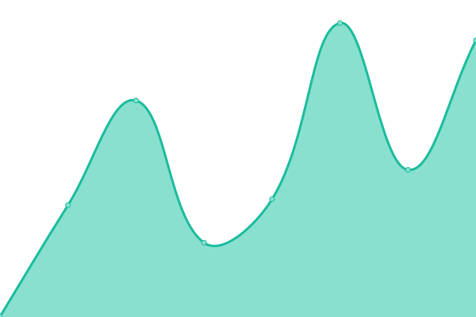

# [📈 Live Status](https://mohorojo.github.io/upptime_test): <!--live status--> **🟧 Partial outage**

This repository contains the open-source uptime monitor and status page for [Chul Won Kang](https://mohorojo.github.io/upptime_test), powered by [Upptime](https://github.com/upptime/upptime).

With [Upptime](https://upptime.js.org), you can get your own unlimited and free uptime monitor and status page, powered entirely by a GitHub repository. We use [Issues](https://github.com/mohorojo/upptime_test/issues) as incident reports, [Actions](https://github.com/mohorojo/upptime_test/actions) as uptime monitors, and [Pages](https://mohorojo.github.io/upptime_test) for the status page.

<!--start: status pages-->
<!-- This summary is generated by Upptime (https://github.com/upptime/upptime) -->
<!-- Do not edit this manually, your changes will be overwritten -->
<!-- prettier-ignore -->
| URL | Status | History | Response Time | Uptime |
| --- | ------ | ------- | ------------- | ------ |
|  [GTS3.org](https://gts3.org) | 🟩 Up | [gts-3-org.yml](https://github.com/mohorojo/upptime_test/commits/HEAD/history/gts-3-org.yml) | 

 353ms
     
 | 

<a href="https://mohorojo.github.io/upptime_test/history/gts-3-org">100.00%</a>
    

|  [Gitlab @ SSLAB](https://gl.gtisc.gatech.edu) | 🟩 Up | [gitlab-sslab.yml](https://github.com/mohorojo/upptime_test/commits/HEAD/history/gitlab-sslab.yml) | 

 447ms
     
 | 

<a href="https://mohorojo.github.io/upptime_test/history/gitlab-sslab">100.00%</a>
    

|  [Mattermost](https://mttmst.gtisc.gatech.edu) | 🟩 Up | [mattermost.yml](https://github.com/mohorojo/upptime_test/commits/HEAD/history/mattermost.yml) | 

 265ms
     
 | 

<a href="https://mohorojo.github.io/upptime_test/history/mattermost">100.00%</a>
    

|  [Firefox File Send](https://ffs.gtisc.gatech.edu) | 🟩 Up | [firefox-file-send.yml](https://github.com/mohorojo/upptime_test/commits/HEAD/history/firefox-file-send.yml) | 

 261ms
     
 | 

<a href="https://mohorojo.github.io/upptime_test/history/firefox-file-send">100.00%</a>
    

|  [CS6265 submission](https://allspark.gtisc.gatech.edu:5001/) | 🟥 Down | [cs-6265-submission.yml](https://github.com/mohorojo/upptime_test/commits/HEAD/history/cs-6265-submission.yml) | 

 0ms
     
 | 

<a href="https://mohorojo.github.io/upptime_test/history/cs-6265-submission">100.00%</a>
    

|  [taesoo.kim](https://taesoo.kim) | 🟩 Up | [taesoo-kim.yml](https://github.com/mohorojo/upptime_test/commits/HEAD/history/taesoo-kim.yml) | 

 457ms
     
 | 

<a href="https://mohorojo.github.io/upptime_test/history/taesoo-kim">100.00%</a>
    

<!--end: status pages-->

[**Visit our status website →**](https://mohorojo.github.io/upptime_test)

## 📄 License

- Powered by: [Upptime](https://github.com/upptime/upptime)
- Code: [MIT](./LICENSE) © [Chul Won Kang](https://mohorojo.github.io/upptime_test)
- Data in the `./history` directory: [Open Database License](https://opendatacommons.org/licenses/odbl/1-0/)
